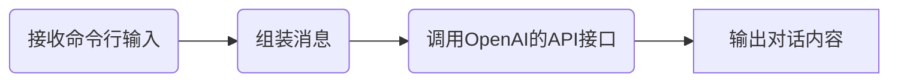

大家好，我是凯文。今天为大家介绍如何使用Python复刻ChatGPT的思路，以及核心代码。


## **预备知识**

首先，Python的版本推荐是3.9。我们需要安装OpenAI的API，这可以通过使用`pip install openai`命令进行完成。接下来，我们需要在OpenAI的网站上注册并申请API密钥，这样我们才能开始使用它们的API（关于如何申请API密钥请另行搜索，或者联系我）

一旦我们有了API密钥，我们就可以从Python中使用OpenAI的API。具体来说，我们需要使用`openai.ChatCompletion.create`函数来生成对话响应。我们还需要使用`GPT-3.5`模型，这可以通过设置model参数为“`gpt-3.5-turbo`”来完成。

下面我们以一个命令行程序来演示整个核心逻辑。我们先来看流程图

## 流程图



## 代码

我们先从如何调用OpenAI的API接口开始，使用自底向上的方法来开发我们的ChatGPT。

```python
from dataclasses import dataclass
from typing import List
import openai

MODEL = "gpt-3.5-turbo"
TEMPERATURE = 0.5

openai.api_key = "YOUR API KEY"
openai.proxy = "socks5h://127.0.0.1:1080"

@dataclass
class Prior:
    question: str
    answer: str
```

上面的代码首先引入三个模块，然后定义模型名称MODEL以及回答内容的创意性Temperature（说人话就是随机性，值的范围是0到2，值越大随机性越大）.

接下来就是设置API Key了，如果你运行程序的电脑不能直接连接到openai的服务器，请设置proxy。

然后定义一下dataclass Prior，这个相当于保存历史记录用的，记录问题及答案文本内容。

下面来看chat函数：

```python
def chat(priors: List[Prior], question: str):
    messages = []
    for prior in priors:
        messages.append({"role": "user", "content": prior.question})
        messages.append({"role": "assistant", "content": prior.answer})
    messages.append({"role": "user", "content": question})
    resp = openai.ChatCompletion.create(
        model=MODEL,
        messages=messages,
        temperature=TEMPERATURE,
        stream=True
    )
    return resp
```

接收一个priors列表，以及一个提问的文本question。函数前半部分组装messages参数，根据历史记录组装一个类似下面列表的列表：

```json
[
  {role: system, "content": "You are a helpful assistant."},
  {role: user, content: question1},    # 历史问题1
  {role: assistant, content: answer1}, # 历史回答1
  {role: user, content: question2},    # 历史问题2
  {role: assistant, content: answer2}, # 历史回答2
  {role: user, content: question}      # 当前问题
]
```

系统消息有助于设置助手的行为。在上面的例子中，助手被指示为“一位乐于助人的助手”，我们暂时就不做设置了，使用默认的即可。

最后一行是当前的问题，然后调用openai.ChatCompletion.create函数，其中stream参数需要注意，stream设置为True就可以像ChatGPT那样有一个打字的效果，可以看到是连续的输出。stream设置为True后，chat函数返回的是一个生成器。下面会看到如何使用。

## Session

```python
class Session:
    def __init__(self):
        self.priors: List[Prior] = []

    def add_chat(self, question: str, answer: str):
        self.priors.append(Prior(question=question, answer=answer))

    def take_last_priors(self, n=2):
        return self.priors[-n:]
```

现在让我们定义一个Session类，用户管理历史的对话信息，take_last_priors方法可以指定拿最后n次的对话内容。

## main方法

```python
def main():
    session = Session()
    while True:
        question = input("问：")
        if question == "QUIT":
            print("Bye!", flush=True)
            exit()
        resp = chat(session.take_last_priors(2), question)
        answer = ""
        print("答：", end="", flush=True)
        for chunk in resp:
            chunk_message = chunk['choices'][0]['delta']
            content = chunk_message.get('content', '')
            answer += content
            print(content, end="", flush=True)
        print("\n"+"-"*10)
        session.add_chat(question, answer)
```

最后一个主函数。首先创建一个session对象，用于管理会话内容。在一个无限循环代码块当中，接收用户的输入，当输入为`QUIT`的时候退出程序。接收到用户的输入后，取最后的2条历史，调用我们上面定义的chat函数。

获得stream的回答之后，通过for循环取出stream迭代器的内容，进行输出。这里有一个需要注意的地方是`print`函数的`flush`的参数，一定要设置为True，才会在接收到部分响应之后立即输出出来。

最后把当前轮的对话信息存入到session对象。如果你希望支持多于2轮的对话，把`take_last_priors`的参数n设置大一点即可（注意OpenAI的API接口的4096个token的限制）。

## 结论

本文主要介绍了如何使用Python和OpenAI的API复现ChatGPT，并提供了相关的代码和流程图。主要步骤包括设置API密钥、调用OpenAI的API接口、创建Session类管理历史对话信息以及构建主函数。通过本文的指导，读者可以了解到如何使用Python和OpenAI的API来构建自己的ChatGPT。

代码请参考我的Github：[https://github.com/kevindragon/ReplicateChatGPT](https://github.com/kevindragon/ReplicateChatGPT)
视频演示：[Bilibili](https://www.bilibili.com/video/BV1284y1M79S/?vd_source=b98760e34db42044d3b7234182634c2d)
